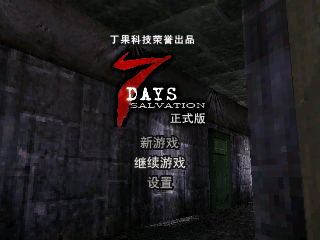
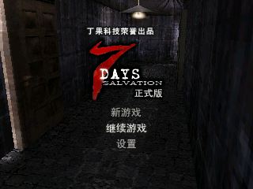

# Dingoo A320 3D runtime and 7 Days port

Last updated: 2026-07-30 (Asia/Irkutsk)

This document records only results that have been reproduced from the official
A320 V1.22 firmware, the native A320 SDK, or the local `7 Days` sample. Items
that still require an H1 runtime probe are explicitly marked **open**.

## Source provenance

Official firmware index:
<https://dl.openhandhelds.org/cgi-bin/dingoo.cgi?0,0,0,0,42,265>

Official firmware payload:
<https://dl.openhandhelds.org/dingoo//uploads/Home/Dingoo%20-%20Firmwares/A320_V1.22.rar>

| Artifact | Size | SHA-256 | Status |
| --- | ---: | --- | --- |
| `A320_V1.22.rar` | 12,469,522 | `48010F10E9D9DD695A1A8D048F54EDD6D210858091D47770770189B9DC581795` | archive passes 7-Zip test |
| `a320.HXF` | 49,293,334 | `42FA20327A294ECD5FE95C2F48E5892F4249C475ABC72E16196A334EEBF7DBE8` | official firmware image |
| LCD/burn configuration `.dl` | 11,152 | `7B1E87C7B0770F7EB24E4B30D30D5FFEF92152AA364A166817ACC93CE5624CBC` | names ILI9331, 320x240, 32 MiB/336 MHz burner family |
| official Windows burner | 794,624 | `2FD12BB5BFD895C22CF41868B50D614479CAEC6C1F3327B7653263705867C62B` | retained as evidence; not executed |

The archive page identifies this as the final official A320 firmware, V1.22,
dated 2010-07-02. V1.20 remains available as archive item 214 but was not needed
to establish the current runtime contract.

Reference projects pinned for reproducibility:

| Project | Commit | Use |
| --- | --- | --- |
| `unterwulf/a320-utils` | `993bc3bd449d7b4838acbcab570c4e859734a24d` | historical HXF structure and pack/unpack implementation |
| `flatmush/dingoo-sdk` | `74c318474d584ebf8cd138bf74fb21ec2fa22bbe` | native SDK, ABI documents, headers, FGL library and samples |
| `bl2ck/DingooExtractor` | `d9f3e6541f9a205ee675dc676dc9c5ffa859d904` | conservative CCDL `.app` extraction |
| `bl2ck/DingooPie` | `7ea896156be452790378d6e3f014a7e0b591da82` | independent HLE/JIT runtime and dynamic tracing |

The matching DingooPie v1.6 release ZIP was downloaded from the GitHub release
page and verified against its published SHA-256:
`BCBAFAB409391C0FD6EC91F78C5094E14BA78AECCFE8352210457E966F62609B`.

## HXF container verification

The V1.22 HXF header is:

| Field | Value |
| --- | --- |
| signature/version | `WADF0100` |
| build timestamp | `200911251549` |
| declared/actual size | 49,293,334 bytes |
| description | `Chinachip PMP firmware V1.0` |
| declared payload checksum | `0xCDF209BF` |
| independently recalculated checksum | `0xCDF209BF` |

The 64-byte header is followed by repeated records containing a little-endian
file-name length, file name, one attribute byte, little-endian data length and
raw data. A zero name length terminates the stream. Parsing reaches the exact
end of file and reports:

- 1,213 members;
- 49,243,430 bytes of member data;
- 49,836 bytes of per-member metadata plus the four-byte terminator;
- first member `ccpmp.bin`, last member `user_data\\user.fm`.

The locally rebuilt historical unpacker is forced into binary output mode on
Windows. A first text-mode extraction was detected because CR/LF translation
made its output larger than the HXF payload; that invalid tree was deleted and
all figures below come from the corrected extraction.

Top-level corrected inventory:

| Group | Files | Bytes |
| --- | ---: | ---: |
| `ccpmp.bin` | 1 | 5,242,880 |
| `codecs` | 11 | 2,469,344 |
| `game` | 373 | 7,544,832 |
| `ivres` | 1 | 6,594,770 |
| `system` | 805 | 14,929,716 |
| `user_data` | 22 | 12,461,888 |

`ccpmp.bin` SHA-256 is
`162BF8020EC01BC8C9D7916188587DC0D3879762CBC6832E94F3C8BEE0FFA2AD`.
The official image also contains Brick, Snake and Tetris `.dl` modules, their
S3D resource packages, an `amb` S3D resource package, a Flash module, and a GBA
emulator `GBA.APP`. `7 Days` is not embedded in V1.22; it is a separately
installed native `.app` game.

## Confirmed A320 execution model

The native SDK documentation identifies the A320 CPU as the little-endian MIPS
derived Ingenic JZ4732 and the native OS as microC/OS-II. The document calls the
CPU 360 MHz, while official burner naming and DingooPie use 336 MHz. The port
must therefore treat 336 MHz as the reproduced timing baseline and not assume
that the marketing clock is the exact OS clock.

Native applications use the CCDL `.app` format and are launched through the
menu item named `3D Game`. The loader copies the RAWD program to its requested
virtual address, fills a named import jump table and calls the exported entry.
The standard A320 application origin is `0x80A00000`.

Display behavior is independently documented by the SDK and exercised by
DingooPie:

- fixed 320x240 framebuffer;
- 16-bit RGB565 pixels;
- `lcd_get_frame` returns a temporary 320x240x2 buffer;
- `lcd_set_frame` transfers it to the Smart LCD controller FIFO with DMA;
- games may also configure the JZ47xx SLCD/DMA path directly.

Input is a 32-bit bitfield returned by `kbd_get_key` or the pressed/released/
held structure returned by `kbd_get_status`. Audio is PCM through the AIC codec
and the `waveout_*` OS services. Timing is based mainly on the approximately
100 Hz microC/OS-II tick; the SDK notes that the native `GetTickCount` low digits
are not monotonic, so `OSTimeGet`/`OSTimeDly` semantics matter to games.

## What A320 "3D" actually is

There is no evidence of a discrete GPU, a memory-mapped 3D command processor,
or a kernel-exported hardware 3D API.

The SDK ships `libfgl.a` (155,092 bytes, SHA-256
`FD639DB200030398D73C00799029ABB7445C26A0C623A83C10FC3B5D7989E92D`).
Its 14 MIPS objects expose fixed-point matrix/transform, clipping, RGB565
texture, depth-buffer, line, sprite and triangle APIs. The archive contains a
large `render.o` with many concrete `raster_triangle_*`, `render_triangle_*`
and `render_sprite_*` variants. Official samples allocate a 320x240 RGB565
draw texture and a 16-bit depth buffer, then call `display_flip` after CPU
rasterization.

DingooPie reaches compatible results by running the guest MIPS and accelerating
recognized software loops for RGB565 copies, transparent/indexed blits and
memcpy/memset-like operations. It does not emulate a 3D GPU.

**Confirmed conclusion:** A320 3D games are CPU software-rendered MIPS programs.
The H1 port must bridge CPU code, framebuffer, input, files, audio and OS task/
timing services. Adding a fictional GPU device would solve the wrong problem.

## `7 Days` static analysis

Local sample:

| Field | Value |
| --- | --- |
| file | `references/dingoo/DingooExtractor/app/七夜正式版.app` |
| size | 59,500,358 bytes |
| SHA-256 | `AF681C338A9932C98A3B450D4391C43D13747F1DFD937232AE38BEDB44359BF0` |
| RAWD origin | `0x80A00000` |
| boot entry | `0x80A000A0` |
| exported `AppMain` | `0x80A001A4` |
| RAWD stored size | `0x0013A2E0` / 1,286,880 bytes |
| RAWD allocation | `0x00145000` / 1,329,280 bytes |
| RAWD SHA-256 | `1BB910C5FC2D90352B8A02656510A9E845D233D21EA78E5117E885F645E08FF1` |
| imports/exports | 72 / 2 (`AppMain`, `getext`) |
| packed resources | 3,574 |

The 72 imports are limited to libc allocation/string/formatting, framebuffer,
keyboard, filesystem, wave output, cache maintenance, USB housekeeping and
microC/OS-II tasks/semaphores/timing. There is no FGL, OpenGL, GPU or 3D-driver
import. The S3D renderer used by the game is therefore statically linked into
RAWD, consistent with the CPU software-rendering conclusion.

The extracted resources contain 3,577 files and occupy approximately 169.33
MiB when the original image and RAWD copy are included. The 3,574 packed game
resources are dominated by `.stx`, `.soj`, `.sai`, `.sau`, `.sst`, `.sbp` and
`.spl` files. `common/default.s3dsty` and `audio/WARPlayer.exe` are present.

## Reproduced dynamic baseline

A 30-second controlled DingooPie v1.6 run used the PPSSPP IR JIT backend, the
published 336 MHz clock, one synthetic `A` press at 9,000 ms, and periodic
framebuffer dumps. The script owned and removed its DingooPie process; the H1
QEMU instance was not restarted.

Observed runtime facts:

- all 72 imports installed as direct hooks; unknown imports: 0;
- VM origin `0x80A00000`, allocation `0x00145000`;
- one secondary task started at `0x80A47770`, priority 16;
- audio opened at 16,000 Hz, signed 16-bit, mono, 2,048 samples;
- startup read about 1.37 MiB through 154 fast reads/seeks;
- active title path used `OSTimeGet`, `OSTimeDly`, semaphore post/pend and
  `waveout_write` heavily;
- after startup the live title background presented about 12-13 frames/s;
- measured average framebuffer interval was 76,917 us; average RGB565 copy
  time was 2,936 us;
- no guest crash or unknown service occurred during the 30-second run.

Reproduced frame progression:

These screenshots document runtime behavior. Copyright and trademarks in the
depicted firmware and game remain with their respective owners; the repository
license does not relicense the depicted artwork.

The frame hashes and complete profile log remain under
`work/tools/DingooPie-v1.6/release/`.

## H1 port boundary

H1 and A320 are both little-endian JZ47xx/MIPS systems, but the OS ABI is not
interchangeable. H1 normal BDA payloads start at `0x83C00020`; A320 RAWD asks
for `0x80A00000`. Directly renaming or repacking the `.app` as BDA cannot work.

The current port plan is:

1. add a small H1 BDA compatibility loader built with the H1 SDK;
2. prove that the A320 RAWD target range can be reserved, written, cache-flushed
   and executed without colliding with the H1 OS;
3. populate the 72-entry A320 import table with H1 wrappers;
4. expose the 320x240 RGB565 frame through the verified H1 480x272 present API,
   preserving aspect ratio and using black side borders;
5. map A320 D-pad/A/B/X/Y/shoulder/Start/Select bits to the H1 full keyboard and
   permanent navigation keys;
6. bridge files, 16 kHz mono wave output, microC/OS-II task/semaphore behavior,
   tick pacing and cache calls;
7. store the roughly 58 MiB game package outside the BDA on the H1 FAT volume;
8. deploy the tested game with a custom icon in the final `其它` game slot and
   add a fixed navigation/input regression script.

Initial live-emulator reads on 2026-07-26 found zero words at the start,
`+0x1000`, middle, and final 256 bytes of
`0x80A00000..0x80B44FFF`. QEMU's monitor addresses physical RAM, so the
corresponding diagnostic range is `0x00A00000..0x00B44FFF`; using the KSEG0
virtual address directly correctly reports inaccessible physical memory.

The subsequent complete live probe proved that these sparse samples were not
sufficient. `h1-bda-sdk/reverse/probes/a320_origin_probe.c` scanned every word,
performed a KSEG1 write/read/restore, invalidated the I-cache and executed a
four-instruction function at `0x80A00000`. Its report at `0x83C005D8` was:

| Field | Result |
| --- | ---: |
| range | `0x80A00000..0x80B44FFF` (`0x00145000` bytes) |
| initial/final FNV-style hash | `0x7AEABA01` / `0x7AEABA01` |
| initial/final non-zero words | 248 / 248 |
| write/read | pass |
| execution result | `0x13579BDF` (expected) |
| restoration | pass |
| report write | pass |
| overall origin-safe result | fail |

At the same stop point the H1 CPU stack pointer was `0x80A6CAF8`, inside the
A320 RAWD range. Therefore original-address loading is rejected even though
the RAM is writable and executable: it would overwrite live H1 kernel/task
state. The probe BDA was transactionally removed and the previous calculator
debug slot was restored byte-for-byte, with no invalid FTL records.

**Confirmed port decision:** allocate a protected H1 heap block for the RAWD,
then relocate MIPS code and in-image pointers from `0x80A00000` to the allocated
base. The import jump table is rewritten to H1 bridge thunks after relocation.
No commercial 7 Days instruction will run until the relocation inventory and
an independent synthetic-code relocation test both pass.

An alternative original-address experiment was also rejected dynamically. The
probe copied the complete range into a 1.329 MiB `.h1_noinit` backup, disabled
interrupts only while changing stacks, switched to a separate 256 KiB
`.h1_noinit` stack, cleared the complete A320 range, executed a synthetic MIPS
function there and opened an H1 modal dialog. Code execution and initial dialog
drawing succeeded, proving the CPU stack itself had moved. However, when the
GUI event loop resumed, H1 entered its fatal exception handler at `0x800043E0`;
the faulting instruction was `0x80166BD8` (`lw a2, 4(s0)`) in the GUI event
consumer. The overwritten range therefore contains live GUI queue/event state,
not just a disposable caller stack. Updating `sp` alone cannot make original-
address loading safe, and altering H1 scheduler/GUI internals would be more
fragile than relocating the self-contained A320 program.

## First H1 compatibility build

The first auditable H1 loader build now completes. The SDK linker gained an
optional fixed `.h1_noinit` address so this port can reserve its runtime memory
without inserting a large zero-filled gap into the BDA payload. ELF inspection
confirms the following layout:

| Region | Address / extent |
| --- | --- |
| H1 BDA entry | `0x83C00020` |
| initialized loader end | below `0x83C15948` |
| relocated A320 arena | `0x83D00000..0x83E44FFF` |
| A320 framebuffer | `0x83E45000..0x83E6A7FF` |
| scaled H1 framebuffer | `0x83E6A800..0x83EAA3FF` |
| audio slots / final end | `0x83EAA400..0x83ECA3FF` |

`H17Days.bda` is 119,764 bytes; the complete 1.83 MiB no-init working set is not
stored in that file. All eight SDK build and A320 relocation tests pass. The
runtime relocation inventory is 11,931 J26, 2,851 HI16 and 3,876 DATA32 sites
(18,658 total), with no unresolved HI16 site. The relocation blob is 74,664
bytes and has SHA-256
`42EEFA6C68DD2589E7ED48812D80FA6AC7573BBB8ADBA2F30DE8E728544DF568`.

Both `_lcd_get_frame` and `lcd_get_cframe` now import a callable H1 bridge that
returns the 320x240 framebuffer. Binding either jump stub directly to the frame
data would execute RGB565 pixels as MIPS instructions and has been explicitly
excluded. The menu icon is derived from the title frame reproduced from the
user-owned firmware; the commercial 59,500,358-byte application remains an
external `A:\应用\数据\7DAYS.APP` and is not embedded in the SDK or BDA.

All Dingoo APP payloads were subsequently standardized under
`A:\应用\数据`. The BDA loader path is encoded as CP936/GBK for the H1 FAT
filesystem; status and save files remain writable runtime state and may stay
at their original locations.

The web virtual keyboard was also rechecked before deployment. Clicking the
keyboard control makes all 38 drawer keys visible (`aria-expanded=true`,
`hidden=false`), and clicking its `A` key increments the emulator input counter
by two events, proving both press and release reach QEMU.

## First relocated-game execution

The rebuilt compatibility BDA is 119,764 bytes with SHA-256
`F833D41707618CFD1DA059836F418EF3A3B9324054668864ECA8BBE3443596FB`.
All 26 current SDK tests pass. Runtime diagnostics are version 2 and continue
to be written to `A:\7DSTAT.BIN`.

The first deployed build exposed one relocation gap: a function address formed
by `LUI`, followed by `JAL`, followed by an `ADDIU` in the branch delay slot was
not included in the earlier HI16 inventory. That left `_kbd_get_status` pointed
at original A320 address `0x80B3A300` instead of relocated address
`0x83E3A300`. Extending the analysis to this instruction ordering produced the
final counts above and eliminated every unresolved HI16 site.

The repaired build has been executed in the ARM64 H1 emulator. A synthetic H1
confirm press advances beyond the game's Chinese "enable sound?" prompt and
the next guest-rendered frame is visible. This confirms the relocated guest is
executing, the A320 input bridge reaches it, and rendering continues after the
prompt. The current frame is not yet correct: it contains repeated/mirrored
texture fragments instead of the reproduced 7 Days title menu. The black side
borders and 320x240 display extent are correct, but neither rendering nor the
port is claimed complete until the corruption is localized between the A320
framebuffer and H1 scaling/submit path. Title-menu navigation, gameplay,
continuous audio and long-run stability remain open until separately
reproduced below.

The corruption has now been localized with direct physical-memory dumps rather
than a browser screenshot. `work/analysis/dingoo/dump_rgb565.py` read the live
RGB565 buffers through the emulator's read-only HTTP diagnostic endpoint and
produced `h1-bda-sdk/build/7days-a320-frame.bmp` (320x240, 153,600 source
bytes) and `h1-bda-sdk/build/7days-h1-frame.bmp` (480x272, 261,120 source
bytes). The repeated/mirrored texture is already present in `a320_frame` at
physical `0x03E45000`; `h1_frame` at physical `0x03E6A800` contains the same
content with the intended aspect-preserving scale and black side borders. This
rules out the H1 blit/present path and web framebuffer transport. The open
defect is inside A320 guest rendering, its ABI bridges, or relocation.

## 7 Days file-I/O ABI diagnosis

The H1 and A320 seek services have different success conventions. The verified
H1 `FS+0x010` service returns the resulting absolute file offset, while the
Dingoo A320 `fsys_fseek` and its `fseek` wrapper return `0` on success and `-1`
on failure. Passing the native H1 result directly to the relocated game was
therefore an ABI bug. The bridge now translates every non-negative H1 result
to A320 success (`0`) and preserves `-1` failures.

A fresh DingooPie v1.6 run of the same SHA-256-verified APP captured the exact
startup file sequence in
`work/tools/DingooPie-v1.6/release/h1-a320-7days-fs-trace-baseline.debug.log`.
The trace has SHA-256
`A8BF75282EE8B04EB4225EB8C8FBE9B42A02DE4DB0FB54C641F994770D9D4B5C`.
The first resource phase performs 154 paired absolute seeks and reads totaling
1,371,173 bytes; every seek returns zero and every read returns one element.
The initial packed-resource offsets and sizes are now available for an exact
H1 comparison instead of visual inference.

The H1 bridge also contains a 512-entry RAM-only I/O trace. Each record stores
the operation, file slot, arguments, A320-visible result, before/after offsets,
and an FNV-1a hash of transferred bytes. It deliberately avoids periodic NAND
writes. This instrumentation remains diagnostic until the H1 and Dingoo traces
are proven identical and is not a substitute for the final ABI implementation.

The first live comparison is now complete. The H1 run captured 354 total file
records with no overflow, including 348 seek/read operations. All 314 operations
present in the controlled DingooPie trace match the H1 sequence exactly, and
every H1 read block hashes to the corresponding bytes in the original APP (zero
content mismatches). The resulting machine-readable report is
`h1-bda-sdk/build/7days-io-trace.json`. NAND content, resource offsets, transfer
sizes, transfer results and seek semantics are therefore excluded as causes of
the broken title textures. Investigation moves to relocated pointers and memory
writes after the verified reads complete.

## Gameplay replay and live-pointer check

The heap bridge now returns every guest allocation at an eight-byte-aligned
address, matching DingooPie. The earlier H1 run had returned 1,901 four-byte-only
addresses among 3,802 allocations. The same build also corrects the one-argument
`__to_unicode_le` allocation ABI and the in-place one-argument
`__to_locale_ansi` ABI. All 26 SDK tests pass and the fixed no-init layout remains
unchanged at `0x83D00000..0x83ECA400`.

A deterministic reference replay used the verified independent APP, DingooPie
v1.6, the PPSSPP IR JIT backend, a 336 MHz guest clock and the same sequence used
against H1: enable sound, move from the default Continue item to New Game, then
advance the opening dialogue. The reference reaches the first interactive 3D
room and averages 12.17 presented content frames/s. Its final reproduced frame
is `work/tools/DingooPie-v1.6/release/h1-a320-7days-gameplay-%03d.bmp`; the
machine-readable profile is
`work/tools/DingooPie-v1.6/release/h1-a320-7days-gameplay-replay.profile.json`.

The H1 build follows the same opening dialogue at approximately 10 frames/s but
eventually submits unchanged black frames while guest instructions, PCM writes,
OS ticks and semaphore traffic continue. QEMU is not stopped and the game task
has not returned. This is the first reproduced gameplay-only defect; a static
Continue screen with an empty save slot must not be classified as a freeze.

`h1-bda-sdk/scripts/scan_7days_live_pointers.py` read every word of the live
1,331,200-byte relocated arena at the black-screen stop. Fifteen word values fall
inside the old `0x80A00000..0x80B44FFF` range, but all fifteen are unchanged MIPS
instruction encodings in IDA-confirmed code ranges. There are zero non-code,
unclassified old-address values. The report is
`h1-bda-sdk/build/7days-live-pointer-scan.json`. A missed whole 32-bit data
pointer in the relocated arena is therefore excluded; the remaining analysis
targets split HI/LO construction, runtime heap state and task synchronization.

## Verified gameplay and performance baseline

The relocation, heap, task and framebuffer fixes now reach the first playable
room with correct 3D content, continuous 16 kHz mono PCM, responsive input and
no black-frame failure. The deterministic launcher reaches the final game slot
without image recognition; visual inspection starts only after the application
has loaded.

The accurate A320 reference was rerun at the official 336 MHz timing with both
`runtime_speed_scale` and `ostimedly_scale` set to `1.0`. It produces 20.25
framebuffer submissions/s and 17.33 content changes/s in the first room. This
supersedes the earlier 65%-speed DingooPie measurement and is the performance
target for the H1 port. Its report is
`work/tools/DingooPie-v1.6/release/h1-a320-7days-room-336mhz-accurate.profile.json`.

The stable ARM64 H1 build was measured for 60 seconds in the same room while a
fixed script exercised movement every 12 seconds:

| Measurement | Result |
| --- | ---: |
| framebuffer submissions | 608 |
| average submission rate | 10.133 fps |
| maximum frame age | 0.106 s |
| guest instruction rate | 7,627,919/s |
| PCM packet rate | 47.915/s |
| QEMU/process failure | none |

The complete report is
`h1-bda-sdk/build/7days-stable-release-60s.json`. The H1 port currently reaches
50.04% of the accurate A320 submission rate, so original-speed performance is
not yet claimed.

A MIPS `WAIT` experiment in the compatibility scheduler was rejected. The H1
firmware's current interrupt model repeatedly resumed the CPU instead of
sleeping until the next useful tick: the run executed more than seven billion
guest instructions and stopped producing frames for over 160 seconds. Removing
`WAIT` restored normal refresh immediately. The rebuilt stable BDA is 209,108
bytes with SHA-256
`8C19D1C73CCABBF81A80F539C8381C06AD3DEC26C2B6E5F20482DA7007066BD3`;
transactional read-back and all FTL records pass in
`h1-bda-sdk/build/7days-stable-redeployment.json`.

IDA analysis identified the dominant bridge timing cost. H1 firmware service
`h1_timer_read_ms()` enters a critical section for every read: it clears CP0
Status.IE, reads the aligned word at `0x8057AE50`, and restores Status. The TCU0
configuration observed live is external clock / 16 with a compare value of 750,
so its interrupt atomically increments that word every 1 ms. The A320 bridge now
reads the same V1.41 kernel word directly without changing interrupt state.

The one-change 60-second test produced 735 submissions, or 12.250 fps, with a
maximum frame age of 0.075 s and 47.932 PCM packets/s. That is a 20.89% gain over
the stable 10.133 fps build and reaches 60.49% of the accurate A320 rate without
changing A320 tick semantics. Evidence is
`h1-bda-sdk/build/7days-direct-tick-60s.json`; the 208,980-byte BDA SHA-256 is
`622448F47F8CEA3E5C5707E754CC797C730B89A44502D2BD662C6A0AAC9DBFAF`,
and transactional deployment is recorded in
`h1-bda-sdk/build/7days-direct-tick-deployment.json`.

Removing the second `update_waiters()` call from the delayed-task loop was also
measured independently. That build produced 731 submissions in 60 seconds, or
12.183 fps, which is slightly below the direct-tick result and within normal run
variance. It provides no performance benefit and changes the scheduler's wakeup
checking for no justified gain, so the call has been restored. The rejected run
is retained as `h1-bda-sdk/build/7days-single-update-60s.json`; it is not a
release candidate.

The restored source was rebuilt and transactionally redeployed after the
negative experiment. The new linker output is 208,980 bytes with SHA-256
`BBC4E09E2B87216614B7D263A32C9991D72390370355736C0FFF38083B309E59`;
NAND read-back and all FTL records pass in
`h1-bda-sdk/build/7days-direct-tick-restored-deployment.json`. A fresh run in the
same first room produced 762 submissions in 60 seconds (12.699 fps), a maximum
frame age of 0.083 seconds and 47.914 PCM packets/s. This confirms the restored
scheduler has no regression, but it still reaches only 62.71% of the accurate
A320 submission rate. The full run is
`h1-bda-sdk/build/7days-direct-tick-restored-60s.json`.

QEMU's per-translation-block guest instruction counter was made optional and
measured with the counter disabled. Contrary to the expected reduction in TCG
overhead, two same-scene 60-second runs fell to 10.945 and 10.916 fps; PCM also
fell to 46.928 and 46.832 packets/s. The QEMU process consumed approximately one
host core throughout, so the result is not an idle/sleep artefact. The reports
are `h1-bda-sdk/build/7days-no-insn-count-60s.json` and
`h1-bda-sdk/build/7days-no-insn-count-repeat-60s.json`. Counter-off is therefore
rejected as a release optimization. The `guest-insn-count` machine property is
retained for controlled diagnostics, but its default remains enabled.

Those first counter runs were subsequently found to share a host-side test
contaminant: the Codex in-app browser still had the live 8793 canvas open. In a
10-second CPU sample, Codex/ChatGPT processes consumed approximately 11.8 CPU
seconds in addition to QEMU's 10.7 CPU seconds. Closing that tab reduced the
Codex/ChatGPT total to about 0.5 CPU seconds. With instruction counting restored
and the browser closed, the same room returned to 12.216 fps, 9,209,936 guest
instructions/s and 47.831 PCM packets/s. This matches the earlier 12.250 fps
direct-tick result; the clean report is
`h1-bda-sdk/build/7days-count-restored-no-browser-60s.json`. Counter-off must be
remeasured under this clean condition before it can be accepted or rejected.

The clean counter-off rerun produced 722 submissions in 60 seconds, or 12.033
fps, with a maximum frame age of 0.100 seconds and 47.798 PCM packets/s. The
matching counter-on result was 12.216 fps and 47.831 PCM packets/s. Disabling
the counter therefore changes frame rate by -1.50% and provides no benefit; the
counter remains enabled by default. The final clean counter-off evidence is
`h1-bda-sdk/build/7days-no-count-clean-60s.json`.

The A320 bridge scheduler was then corrected to respect the numeric priority
ordering used by microC/OS-II. A running task now yields only to a ready task
with a numerically lower priority; a delayed or semaphore-blocked task still
yields unconditionally. This matters because the 7 Days main task runs at
priority 0 while its audio task is created at priority 16. The previous
round-robin bridge allowed the lower-priority audio task to preempt the main
task after every framebuffer and audio submission.

The corrected scheduler completed the same first-room 60-second movement test
with 778 submissions, or 12.966 fps, a maximum frame age of 0.104 seconds and
47.914 PCM packets/s. This is 6.14% above the clean 12.216 fps baseline and
reaches 64.03% of the 20.25 fps DingooPie reference. QEMU remained running and
audio never stopped. The report is
`h1-bda-sdk/build/7days-priority-scheduler-60s.json`; the corresponding PC
profile is `h1-bda-sdk/build/7days-priority-scheduler-pc-profile.json`.

The new PC profile still attributes 62.83% of samples to the H1 bridge, 33.67%
to H1 firmware and only 3.50% to original A320 game code. The two hottest PCs
remain inside the `OSTimeDly` wait loop (44.0% combined), followed by
`schedule_once` at 10.25%. Scheduler priority was therefore a real but bounded
improvement rather than the complete performance solution.

## Physical feedback and audio ABI correction

The first physical H1 test of the three initial ports produced three distinct
results. 7 Days reached gameplay with correct display, controls and exit but
had no sound. Doom also had no sound and did not accept the physical `Y` key at
its quit prompt. PAL displayed only black after launch, still emitted key
sounds, could not exit, and had no menu icon. These results apply to the older
test package and are retained here so later emulator success is not mistaken
for hardware confirmation.

IDA analysis of factory Chinese Chess and Mission BDA files recovered the H1
PCM contract that the A320 bridge had missed. Descriptors have a 32-byte stride:
the caller supplies `pcm` and `bytes`, while six following words are initialized
and owned by `SYS+0x50`. The old eight-byte bridge happened to play in QEMU but
never created this hardware state. Both the dedicated 7 Days bridge and shared
A320 runtime now retain 32-byte descriptors, call `SYS+0x50` before submission,
and call `SYS+0x54` during teardown. The full evidence is in
`h1-bda-sdk/reverse/docs/audio_api.md`.

The rebuilt hardware 7 Days BDA is 209,860 bytes, SHA-256
`D45C0AA0B704379619468F601EAAFDAF3AED47D17410A696997C9B3F6D370B16`.
Its emulator counterpart reached the first room and passed the repeatable
30-second movement test in `h1-bda-sdk/build/7days-current-stability.json`:
292 frames, 483,308 output audio frames at 16 kHz, zero underruns and equal DMA
completion/rearm counts. The corrected audio path now needs physical retesting.

A direct-render experiment replaced `GUI+0x400` with writes to the V1.41
firmware RGB565 framebuffer at `0x80D55AA0`. IDA confirms that this address is
the actual 480x272 RGB565 source consumed by `0x80166654`, not a pointer
variable. Nevertheless, two clean launches returned to the desktop before the
first 7 Days frame, while restoring the verified `GUI+0x400` path immediately
reached the sound prompt again. Direct framebuffer rendering is rejected until
the additional GUI draw-state contract is understood; the deployed build has
been restored to the verified blit path.

## PAL cross-basic-block relocation diagnosis

The first PAL input event reached exception 27 at relocated PC `0x83D00798`
with `a0=0` and `t0=0x80AA0000`. Live memory and QEMU translation logging
proved that the relocated instruction stream itself was current: the load at
`0x83D00790` was `lw a0,-0x1AAC(t0)`, while the immediately preceding LUI at
`0x83D0078C` had already been patched to `0x83DA`.

IDA CFG analysis of original function `sub_80A00528` identified a second path
into that block. The conditional branch at `0x80A00598` jumps directly to
`0x80A00790`, and its architectural delay slot at `0x80A0059C` contains another
`lui t0,0x80AA`. That LUI had no nearby linear LO16 use and was omitted by the
old relocation inventory, leaving the branch-taken path with an original A320
pointer. This confirms a generic cross-basic-block, delay-slot dataflow gap; it
is not a cache, stale-TB, H1 timer, or input-device defect. The relocation
builder now follows MIPS delay-slot CFG successors so every reachable LUI
definition can be audited. Emulator and hardware validation remain pending
until the regenerated PAL image passes the input path.

The next menu action reaches a separate dataflow form in
`sub_80A275DC`. At `0x80A276D4`, `lui s1,0x80AA` is spilled to a stack
slot, restored into `t4` at `0x80A2770C`, and consumed as the base of
`lw a0,0x2E10(t4)` at `0x80A2771C`. The unrelocated spill leaves
`t4=0x80AA0000`, which makes the derived load at relocated PC
`0x83D27738` dereference zero. The generic analysis therefore also tracks
address dependencies through word-sized SP/FP spill and reload slots. Runtime
validation of this second fix is now complete.

## PAL completed validation

The two generic relocation fixes above are validated end to end. The final PAL
inventory contains 10,746 JUMP26, 5,137 HI16 and 2,567 DATA32 entries (18,450
total), no unresolved HI16 reference, and relocation SHA-256
`8B7B26D7ECBC686DEB2A5AD6C531BBC09A346F6DC5D092A7FF2ABF3E387C699D`.
All 14 relocation tests pass, including the branch-delay-slot and stack
spill/reload regressions.

Two independent emulator boots exercised the title sequence, main menu, new
game, opening dialogue, free movement, continuous 22.05 kHz PCM, game menu,
five save slots and exit confirmation. The second boot loaded the first saved
slot, moved the character and returned cleanly to the H1 desktop. A writable
NAND comparison proves that saving created `/p1.rpg` (188,864 bytes, SHA-256
`62271EECBB5A6DF74F417E4288421BB812251630FCAAF01B4818ECC385E22650`)
and `/PALSTAT.BIN` (100 bytes, SHA-256
`CC62B0E473BC9710CE76DC659E05C9AF9C723CC90C4A91D365190869E09062EA`).
The machine-readable comparison is `h1-bda-sdk/build/pal-save-nand-diff.json`.

`navigate_emulator_game_slot.py` now treats both `complete` and
`not-required` as ready calibration states. It also accepts one stable frame
after the 15-second boot floor, because an already calibrated writable NAND
draws the time-change prompt only twice and legitimately remains there until
input. This removes the former false 90-second timeout.

The first physical test exposed two release-only assumptions: the program was
still using the emulator asset bridge rather than opening `A:\\PAL.APP`, and
the packaged BDA predated the custom icon resources. The hardware loader now
uses the H1 filesystem path directly and includes the decoded four-size PAL
icon. The current emulator build again passed the title animation, new-game
menu, opening dialogue, continuous 22.05 kHz PCM and `Esc` context return with
the same QEMU PID.

The final hardware artifact is `h1-bda-sdk/build/H1PAL.bda`, 221,988 bytes,
SHA-256
`FEB597BEE15592E71E9CE6AE927AC9E07754D338212A2ED98B1973CC3282CD8E`.
It requires the original 28,004,275-byte APP at `A:\PAL.APP` (SHA-256
`08A835410EE9C7298E37B2C388E637A20F3E0D5D9E854F955373989448A9CDFF`).
The BDA belongs at `A:\应用\程序\H1PAL.bda`.

The QEMU-only global TB flush remains necessary when another relocated game is
loaded into the fixed `0x83D00000` arena, but the temporary PAL instruction and
flush logging has been removed. The rebuilt ARM64 QEMU SHA-256 is
`8FD2E6E53EDA5D11B8DBD442DC6AEECE1FB8824CB8BA462B81F12C1672EC2D04`;
a fresh PAL launch reached the animated title with active PCM and no diagnostic
noise. The reusable FAT/FTL file comparator is
`h1-bda-sdk/scripts/compare_emulator_nand.py`.

## `天地道` completed port

The third target by descending size has completed the generic static pipeline.
The 20,418,002-byte APP has SHA-256
`6FA335AD49FE2FE68E6ECE552D72C2DEC352E715B7255FDCE9AED88248FB2C23`.
IDA analysis produced 13,162 JUMP26, 3,101 HI16 and 3,892 DATA32 relocations,
with zero unresolved HI16 references. The relocation table SHA-256 is
`EE0604EC6C5C6DF82AF01EEC1663D64AF4BB66DA190E44042A6E3C880553FDD2`.

The H1 run reaches the original Heaven Striker II menu and starts a new game.
The software-rendered 3D scene, player movement and sword attack are visible and
responsive. PCM remains continuous at 16 kHz mono with no QEMU error or
underrun.

An independent DingooPie run of the same SHA-256-verified APP resolved the
apparent black-overlay discrepancy. A320 Start opens the same empty black
horizontal quick-selection strip on the original runtime. Direction Down then
reveals the numeric selections `0`, `1`, and so on, and A closes the strip. It
is original game behavior rather than missing H1 text or a scaler defect. The
reference run is
`work/tools/DingooPie-v1.6/release/h1-a320-td1-pause-reference4.profile.json`.

The reusable `verify_emulator_gameplay.py` harness then sampled a live H1 game
every five seconds for 60 seconds while injecting 11 directional presses. The
QEMU PID stayed fixed, the framebuffer advanced by 740 frames, PCM output
advanced by 953,553 frames, DMA completion and rearm counts remained equal, and
audio underruns remained zero. The machine-readable report is
`h1-bda-sdk/build/td1-stable-60s.json`.

A320 frontends own their exit command, while the APP itself does not reliably
return from gameplay. The shared compatibility runtime now keeps H1 Back/K as
the A320 B action and reserves the distinct H1 Esc key for a checked MIPS
context return. Esc closes PCM and returns to the H1 desktop without restarting
QEMU. This path was exercised after a cold rebuild and redeployment; the final
desktop capture is `h1-bda-sdk/build/td1-exit-test-desktop.png`.

The final hardware BDA is `h1-bda-sdk/build/H1TD1.bda`, 263,988 bytes,
SHA-256
`E63006CD24E1457720C345E4DD8B04B47BC107CDF5232404BEB41500092C279C`.
It requires the original APP at `A:\TD1.APP`, 20,418,002 bytes, SHA-256
`6FA335AD49FE2FE68E6ECE552D72C2DEC352E715B7255FDCE9AED88248FB2C23`.
The BDA belongs at `A:\应用\程序\H1TD1.bda`.

## `天地道II` completed port

The fourth target initially appeared to hang before its first frame even though
its 72 static imports were already covered by the shared runtime. Static and
live analysis found a separate dynamically loaded `CCDL` module exporting
`tvd_detect` and `tvd_calc`. The detector bit-bangs A320 GPIO and TCU registers
to communicate with an external TVD copy-protection device. H1 does not contain
that device. `AppMain` retries the detector ten times and deliberately enters
an infinite loop when every attempt fails.

The port therefore applies one explicit post-relocation compatibility patch at
original address `0x80B05158`: `0x24020001` (`li v0,1`). This replaces only the
detector result at the call site and leaves the original APP, dynamic module,
relocations and game logic unchanged. The generic builder now accepts repeatable
`--patch-word ADDRESS=VALUE` options, validates alignment and program range, and
applies the generated patch list after relocation and import resolution. All 19
`test_a320_*.py` tests pass, including the new address validation and generated
patch-table regressions.

The final ARM64 emulator run reached the animated water-ink title, main menu,
new-game introduction and live software-rendered 3D gameplay. Direction and
action input remained responsive. A 60-second stability run advanced 533 frames
and 960,132 guest PCM frames; the host output advanced 967,191 frames at 16 kHz,
with zero underruns and the same QEMU PID. The report is
`h1-bda-sdk/build/td2-stable-60s.json`.

The final icon-bearing package was transactionally deployed and read back with
no invalid FTL record. Its dedicated four-size bitmap icon, derived from the
game's red-black taiji emblem, appeared in the last `其它` slot with the title
`天地道II`. Launch through the web UI reached the animated title, and the web
full-keyboard Esc control returned to the desktop without restarting QEMU.
Evidence is in `h1-bda-sdk/build/td2-icon-final-slot.png` and
`h1-bda-sdk/build/td2-icon-deployment.json`.

The final physical H1 BDA is `h1-bda-sdk/build/H1TD2.bda`, 272,420 bytes,
SHA-256
`CEEAF06798639D2AA56999520E49FA8581A1DEA309B4A2E908F3363D5103D28B`.
It requires the original 16,537,537-byte APP at `A:\TD2.APP`, SHA-256
`0739C0D6F6C82EE4333D6B627EFFC7F827EC84150C6859AE1F1572118AFDC897`.
The BDA belongs at `A:\应用\程序\H1TD2.bda`. Emulator validation is complete;
physical H1 validation remains pending.

## `极限漂移` completed port

The fifth target exposed a generic relocation defect before its first game
frame. The first build entered the H1 exception stop loop at `0x8002FDC0` after
a virtual call returned through relocated address `0x83D839B4`. Live object
memory proved that the vtable itself had moved to `0x83DAD970`, but entries at
original addresses `0x80AAD974..0x80AAD990` still contained eight unrelocated
`0x80AA....` function pointers. IDA had decoded those pointer words as stray LB
instructions and exported a code range even though no real function owned it.
The resulting virtual call entered unrelated H1 firmware at the same address.

The relocation builder now tracks real IDA function ownership separately from
all decoded code ranges. A program-range word in a stray code range is recovered
as DATA32 only when its value is a known function entry; instructions owned by a
real function remain excluded. This added exactly eight audited vtable records
for this APP. Two regressions cover both recovery and the false-positive guard;
all 21 `test_a320_*.py` tests pass. The final inventory contains 7,631 JUMP26,
1,620 HI16 and 1,818 DATA32 entries, with no unresolved HI16 reference. Its
relocation table SHA-256 is
`07293793D21A99C218D41CB12930A3E7EF969D07FFA4129476643926F6736820`.

The corrected build reached the original `ULTIMATE DRIFT` sound prompt, title,
tournament menu, vehicle selection and live 3D race. Steering and acceleration
changed the vehicle and minimap position. A 60-second race test advanced 2,785
frames, 959,875 guest PCM frames and 969,251 host output frames at 16 kHz. Audio
underruns remained zero, DMA completion/rearm counts stayed equal and the QEMU
PID did not change. The machine-readable report is
`h1-bda-sdk/build/drift-stable-60s.json`.

The final package uses a dedicated chequered-flag `UD` icon matching the title
screen. A cold deployment showed that icon and the correct `极限漂移` title in
the final `其它` slot, reached the original sound prompt, and returned with Esc
to the intact desktop under the same PID. Captures are
`h1-bda-sdk/build/drift-final-icon.png`,
`h1-bda-sdk/build/drift-final-launch.png`, and
`h1-bda-sdk/build/drift-final-exit.png`.

The final physical H1 BDA is `h1-bda-sdk/build/H1Drift.bda`, 217,892 bytes,
SHA-256
`D3463B3EEE7CAC8031F2408FE932AB08612DFDCB7A3C09D1C87EB92D48FC747B`.
It requires the original 15,443,327-byte APP at `A:\DRIFT.APP`, SHA-256
`E4E23B19515716445EEE4A79BF6F081B77F5C0911D43456205902475653373F9`.
The BDA belongs at `A:\应用\程序\H1Drift.bda`. Emulator validation is complete;
physical H1 validation remains pending.

## `战神刑天` completed port

The sixth target uses the shared compatibility runtime without a game-specific
code patch. Its 15,402,572-byte APP has SHA-256
`71C10376DEDEEB30607D9C332F883FF549962094311A967618C9C323A2C18331`.
Static preparation produced 8,981 JUMP26, 2,206 HI16 and 3,142 DATA32
relocations, including 14 audited vtable entries recovered from stray IDA code
ranges. There are no unresolved HI16 references. The relocation table SHA-256
is `22EF73C19721A8DC1996D8E05AD8F17719C78D948EC62067300A20FB596A6F5F`,
and all 21 `test_a320_*.py` regressions pass.

A cold ARM64 emulator run reached the original title, new-game menu, narrated
opening and live 3D combat. Alternating movement and action input for 60 seconds
advanced 617 distinct frames, 959,782 guest PCM frames and 969,127 host output
frames at 16 kHz. Audio underruns remained zero, DMA completion/rearm counts
stayed equal and QEMU PID 2672 did not change. Start and end captures show the
character at different positions and orientations. The machine-readable report
is `h1-bda-sdk/build/xingtian-stable-60s.json`.

The final package uses a dedicated bronze crossed-blade `XT` icon derived from
the game's title palette. Transactional FAT/FTL deployment read the complete BDA
back byte-for-byte and found zero invalid records. A second cold launch showed
the new icon and correct `战神刑天` title, reached the original animated title,
and returned with Esc to the intact H1 desktop under the same PID. Evidence is
in `h1-bda-sdk/build/xingtian-final-icon.png`,
`h1-bda-sdk/build/xingtian-final-title.png`,
`h1-bda-sdk/build/xingtian-final-exit.png`, and
`h1-bda-sdk/build/xingtian-final-deployment.json`.

The final physical H1 BDA is `h1-bda-sdk/build/H1Xingtian.bda`, 228,964
bytes, SHA-256
`210FC9DDDE77479E0DFDC406764810EF5A411AA41047D833C4FF72554814F452`.
It requires the original APP at `A:\XINGTIAN.APP`. The BDA belongs at
`A:\应用\程序\H1Xingtian.bda`. Emulator validation is complete; physical H1
validation remains pending.

## `赵云传` completed port

The seventh target also runs on the shared compatibility runtime without a
game-specific patch. Its 11,092,158-byte APP has SHA-256
`3A59BD1C0DABFF74C8CCED69F50E3E95BC74CE0EA613AD6BE9D77F48D9967ECE`.
IDA preparation generated 3,467 JUMP26, 1,564 HI16 and 1,341 DATA32
relocations with no unresolved HI16 reference. The relocation table SHA-256 is
`5E55F6BEAC3C16AE799091AFE75EE72922E49794C05E8FBB47413D7017FE1A0C`.

The ARM64 H1 run reached the original moonlit title, selected a new game,
advanced the opening dialogue and entered the free-movement indoor map.
Alternating four directions and the action key for 60 seconds moved and turned
the character while the QEMU PID remained 15988. This event-driven 2D game
redraws only when its state changes, so the test advanced 32 frames rather than
using a continuous animation loop. PCM remained continuous at 16 kHz, advanced
960,324 guest frames and 952,219 host output frames, and recorded zero
underruns. The report and visual endpoints are
`h1-bda-sdk/build/zhaoyun-stable-60s.json`,
`h1-bda-sdk/build/zhaoyun-stability-start.png`, and
`h1-bda-sdk/build/zhaoyun-stability-end.png`.

The final package adds a dedicated moon, spear and `ZY` icon based on the title
art. Transactional deployment verified byte-for-byte readback and zero invalid
FTL records. A cold boot displayed the icon and correct `赵云传` title, launched
the original title screen, and Esc returned to the intact desktop under the
same QEMU PID. Evidence is in `h1-bda-sdk/build/zhaoyun-final-icon.png`,
`h1-bda-sdk/build/zhaoyun-final-title.png`,
`h1-bda-sdk/build/zhaoyun-final-exit.png`, and
`h1-bda-sdk/build/zhaoyun-final-deployment.json`.

The final physical H1 BDA is `h1-bda-sdk/build/H1Zhaoyun.bda`, 176,228
bytes, SHA-256
`A3E9DA0B733E1200E819615BD40AC48197B67D7DACEA046D779047230DAAAA77`.
It requires the original APP at `A:\ZHAOYUN.APP`. The BDA belongs at
`A:\应用\程序\H1Zhaoyun.bda`. Emulator validation is complete; physical H1
validation remains pending.

## `阿里巴巴` completed port and `dl_res_*` ABI

The eighth target is the first of six games that use the Dingoo dynamic-loader
resource API instead of opening every packed resource through `fsys_fopen`.
DingooPie HLE source confirms the full calling convention: `dl_res_open`
accepts the resource name in `a0`, `a1`, or `a2`; nonzero handles index a
128-entry table; `dl_res_get_data` supports both caller-owned segmented reads
and a null-buffer whole-resource allocation; close frees both forms. The H1
runtime now implements those semantics against the same verified APP resource
manifest and hardware/emulator asset readers. It does not return synthetic
success values. `get_dl_handle` and all four `dl_res_*` imports are covered by
two new regressions, bringing the `test_a320_*.py` suite to 23 passing tests.

The original 9,659,360-byte APP has SHA-256
`1B5A929A93DDA5C312E01205F95F363EFA0F69F1EAD2F703714D4366F8495912`.
Static preparation generated 4,312 JUMP26, 1,090 HI16 and 1,459 DATA32
relocations with no unresolved HI16 reference. The relocation table SHA-256 is
`BB5A09B698582EAC254EF7BE6EEE60AFAD9238F7C696FB3CBEA9B239798BAEB1`.

The ARM64 run loaded the original illustrated title, main menu, mode and map
selection, story page, and live board-game scene. The latter proves decoded
dynamic-loader resources rather than only startup code: characters, land
tiles, purchase dialogue and the full HUD are present. A 60-second run moved
the player between visibly different board positions and changed money/state,
while advancing 527 frames, 960,081 guest PCM frames and 953,156 host output
frames at 16 kHz. Audio underruns remained zero and PID 6412 did not change.
The report is `h1-bda-sdk/build/alibaba-stable-60s.json`.

The final package adds a desert palm, die and `AL` icon. Transactional
deployment passed byte-for-byte readback with no invalid FTL record. A cold
boot displayed that icon and the correct `阿里巴巴` title, launched the original
cover, and Esc returned to the intact desktop under the same PID. Evidence is
in `h1-bda-sdk/build/alibaba-final-icon.png`,
`h1-bda-sdk/build/alibaba-final-title.png`,
`h1-bda-sdk/build/alibaba-final-exit.png`, and
`h1-bda-sdk/build/alibaba-final-deployment.json`.

The final physical H1 BDA is `h1-bda-sdk/build/H1Alibaba.bda`, 184,420
bytes, SHA-256
`9E173EDD11770865BC920F25F1BF08C7CB02D52A14904729D46B9DB46B8956C3`.
It requires the original APP at `A:\ALIBABA.APP`. The BDA belongs at
`A:\应用\程序\H1Alibaba.bda`. Emulator validation is complete; physical H1
validation remains pending.

## `霸王战机` completed port, corrected TVD patch and key-event ABI

The ninth target has a 9,459,552-byte APP with SHA-256
`75D110F6616DFD5D2F420EDDD380112D48A0B31A66A4065C16A9A2B5794EEE32`.
Static preparation generated 2,156 JUMP26, 2,148 HI16 and 503 DATA32
relocations with no unresolved HI16 reference. The relocation table SHA-256 is
`9C12FA623F90A2CC646548F7F7F818FB3282A6A202D679A638E1F9EE000DE36F`.

IDA analysis corrected two game-specific compatibility faults. The TVD
anti-copy function itself must be bypassed at `0x80A0C108` with
`li v0, 1` (`0x24020001`); the earlier candidate `0x80A0C10C` is only the call
delay slot and does not prevent the check from running. The old GUI key-event
callback at `0x80A21D34` also passes its cross-SDK continuation through MIPS
`$k0/$k1`. Those registers are reserved for the kernel and can be overwritten
by an H1 interrupt, corrupting the return address and stack. The build tool now
accepts an optional `--key-event-wrapper-address`; the runtime wrapper preserves
the callback context and reproduces the original event codes without changing
other games. The complete `test_a320_*.py` suite now has 27 passing tests.

The ARM64 H1 run reached the title and live scrolling flight scene with 8 kHz
audio. A 60-second input run issued 39 key presses and advanced 678 display
frames, 479,848 guest PCM frames and 475,858 host output frames. Audio
underruns remained zero. Esc returned to the intact desktop under the same
QEMU PID. The report is `h1-bda-sdk/build/bwfighter-stability.json`; final
deployment evidence is in `h1-bda-sdk/build/bwfighter-final-icon.png`,
`h1-bda-sdk/build/bwfighter-final-title.png`,
`h1-bda-sdk/build/bwfighter-final-exit.png`, and
`h1-bda-sdk/build/bwfighter-final-deployment.json`.

The final package uses a dedicated player-aircraft icon taken from the game's
actual flight scene. The physical H1 BDA is
`h1-bda-sdk/build/H1BWFighter.bda`, 170,276 bytes, SHA-256
`E4D14DF8EED0F665D0DC99E9966EE313140FB51EEAFA4A4EF1BC83D2273B203E`.
It requires the original APP at `A:\BWFIGHTER.APP`; the BDA belongs at
`A:\应用\程序\H1BWFighter.bda`. Emulator validation is complete; physical H1
validation remains pending.

## `斗地主` completed port

The tenth target runs on the shared compatibility runtime without a
game-specific code patch. Its 9,229,392-byte APP has SHA-256
`A591E374807627B8E8A952F5421349AFDEF9FC99F4DC0B982418A1C0323C6A89`.
The 77 imports are all backed by existing runtime implementations. Static
preparation generated 2,985 JUMP26, 1,514 HI16 and 1,293 DATA32 relocations
with no unresolved HI16 reference. The relocation table SHA-256 is
`B63CADE20116A8050B2303E254EE3D01657C37CBB78EA10C746C3E4BC7AD9433`.

The ARM64 H1 run reached the original illustrated title, dealt a complete hand
and entered a live three-player game with character portraits, cards, timer,
landlord state and play/pass controls. A 60-second run issued 39 navigation and
action key presses. This turn-driven game advanced 23 display frames while
advancing 959,338 guest PCM frames and 954,000 host output frames at 16 kHz.
Audio underruns remained zero and QEMU PID 9056 did not change. The report is
`h1-bda-sdk/build/doudizhu-stability.json`.

The final icon uses the original in-game player portrait with a deterministic
card/table composition. A cold deployment displayed that icon and the correct
`斗地主` title, launched the title and an actual hand, and Esc returned to the
intact desktop under QEMU PID 15836. Evidence is in
`h1-bda-sdk/build/doudizhu-final-icon.png`,
`h1-bda-sdk/build/doudizhu-final-title.png`,
`h1-bda-sdk/build/doudizhu-final-game.png`,
`h1-bda-sdk/build/doudizhu-final-exit.png`, and
`h1-bda-sdk/build/doudizhu-final-deployment.json`.

The final physical H1 BDA is `h1-bda-sdk/build/H1Doudizhu.bda`, 182,692
bytes, SHA-256
`292D7A5DB1B71B4A9793472F5DFCD5056C301AE4F18122D8C775B46B2F5AFF50`.
It requires the original APP at `A:\DOUDIZHU.APP`. The BDA belongs at
`A:\应用\程序\H1Doudizhu.bda`. Emulator validation is complete; physical H1
validation remains pending.

## `卢比卢比` completed port

The eleventh target also runs without a game-specific code patch. Its
4,992,960-byte APP has SHA-256
`2804FF20F07F82BDCA59EB1BCD6ACE9615862788559F865E11BF0F67547BE6F1`.
All 77 imports are supported by the shared runtime. Static preparation
generated 2,683 JUMP26, 1,518 HI16 and 1,335 DATA32 relocations with no
unresolved HI16 reference. The relocation table SHA-256 is
`84C4BC1423F5091565BD38EEF3A0CB5A22A66C622608DDD3F5AB99C6360A3FD9`.

The ARM64 H1 run reached the original character title, difficulty selector and
live tile-matching board. A 60-second run issued 39 direction/action key
presses, moved the selection highlight across the board and advanced 106
display frames, 959,595 guest PCM frames and 951,826 host output frames at
16 kHz. Audio underruns remained zero and QEMU PID 14796 did not change. The
report is `h1-bda-sdk/build/lubilubi-stability.json`.

The final icon is a deterministic crop of the original red, yellow and blue
title characters. A cold deployment displayed it with the correct `卢比卢比`
title, entered a real board and returned with Esc to the intact desktop under
QEMU PID 13164. Evidence is in
`h1-bda-sdk/build/lubilubi-final-icon.png`,
`h1-bda-sdk/build/lubilubi-final-title.png`,
`h1-bda-sdk/build/lubilubi-final-stage.png`,
`h1-bda-sdk/build/lubilubi-final-exit.png`, and
`h1-bda-sdk/build/lubilubi-final-deployment.json`.

The final physical H1 BDA is `h1-bda-sdk/build/H1LubiLubi.bda`, 180,452
bytes, SHA-256
`4D1BD2EBCF60A555FE6CEEC8F4C4BD868E15DF31F0F60E994B0E96CFCAFFA699`.
It requires the original APP at `A:\LUBILUBI.APP`; the BDA belongs at
`A:\应用\程序\H1LubiLubi.bda`. Emulator validation is complete; physical H1
validation remains pending.

## `打砖块` completed port

The 4,639,525-byte Brick Breaker APP contains two valid short-name packed
resource tables. The first begins at file offset `0x00050000` and has 66
records; the second begins at `0x00250000` and has 70 records. Duplicate names
are intentional localization variants rather than corrupt aliases. Decoding
the original RGB565 `s3dtex` payloads proves that the first table contains
Simplified Chinese title, help, win, loss and menu artwork, while the second
contains the corresponding English artwork. The side-by-side evidence is
`work/analysis/dingoo/brick-resource-pairs.png`.

This agrees with the official SDK language constants: value `0`, already
returned by the H1 compatibility runtime, means Simplified Chinese. It also
agrees with the original lookup behavior: resource names are matched in APP
order and the first case-insensitive match wins. The port builder now preserves
all resource records in package order instead of rejecting a later localized
record as ambiguous. A regression constructs two differently cased duplicate
names and verifies that both records and their original order survive code
generation.

The first runtime attempt aborted while allocating `0x260A1300` bytes. IDA and
the allocation trace showed that this was not a heap-size problem. The game
uses ordinary `fopen("brick.bin", "rb")` for a writable color/save database,
while its packed APP also contains a same-named level resource. The shared
runtime incorrectly gave packed resources priority for every read-only stdio
open. Bytes `01 00 3F 00 00 13 0A 13 00 13 0A 26` from the level resource were
therefore parsed as a linked-record count, identifier and length; the last four
bytes explain the exact failed allocation. The generic builder now accepts a
repeatable `--filesystem-only-name` profile setting. `brick.bin` bypasses
packed-resource lookup only for stdio, while `dl_res_*` can still access the
packed level resource. Other games retain their existing behavior.

The official game is a portrait title intended to be played with the A320
rotated. H1's landscape screen and full keyboard cannot be used that way, so
the port enables a per-game counterclockwise framebuffer transform. The
original 240x320 portrait image is rendered at 204x272 with black side bars and
no aspect-ratio distortion. Direction input rotates with it: H1 left/right map
to A320 up/down, and H1 up/down map to A320 right/left. Confirm remains the A
button and the physical Esc key safely restores the H1 desktop.

The ARM64 H1 run reached the Simplified Chinese title, quick-start menu and an
active level. A 60-second run issued 39 left/right inputs and advanced 741
display frames, 479,627 guest PCM frames and 476,106 host output frames at
8 kHz. Audio underruns remained zero and QEMU PID 13276 did not change. The
report is `h1-bda-sdk/build/brick-stability.json`. Cold-deployment evidence is
in `h1-bda-sdk/build/brick-final-icon.png`,
`h1-bda-sdk/build/brick-final-title.png`, and
`h1-bda-sdk/build/brick-final-exit.png`; the transactional NAND report is
`h1-bda-sdk/build/brick-final-deployment.json`. The final icon is cropped from
the verified live level and shows original bricks and paddle artwork.

The physical H1 BDA is `h1-bda-sdk/build/H1Brick.bda`, 173,540 bytes,
SHA-256 `41A33F819A37560F75FBE124E79FC50ACFE79B3315912DEBE7B8C0D9591C3D06`.
It requires the original 4,639,525-byte APP at `A:\BRICK.APP`, SHA-256
`C5ADC7DED226705FCB3A1AA80AC41D9AB96B6B6916D99A59A7068FEA722B9F93`.
The BDA belongs at `A:\应用\程序\H1Brick.bda`. Emulator validation is complete;
physical H1 validation remains pending.

Completion status for the 17 official A320 games is now **12/17**: `7 Days`,
PAL, `天地道`, `天地道II`, `极限漂移`, `战神刑天`, `赵云传`, `阿里巴巴`,
`霸王战机`, `斗地主`, `卢比卢比`, and `打砖块` are playable. DOOM is a separate
open-source H1 port and is not counted in this total. The next target by
descending APP size is `糖果屋`.

## 2026-07-29 second physical-H1 test results

The user's V1.41 H1 test separates emulator completion from physical-hardware
completion. PAL has audio in the start/load UI, loses it during story movement,
can temporarily recover it in the menu, and reboots when attacking an enemy in
battle. `7 Days` has door sound effects but no background music. Alibaba is
silent. Drift and Zhao Yun freeze immediately after launching. Tiandi Dao shows
its opening text and then freezes on a black screen. Tiandi Dao II freezes on
launch. Xingtian has sound but freezes after entering the map.

These eight observations are confirmed physical-H1 results. Their current BDA
files remain emulator-validated only and must not be described as physical-H1
complete until replacement builds pass the corresponding scene transitions,
audio behavior and battle action on the real device.

## Strict 64 MiB retest and PAL interrupt-stack corruption

The emulator-only SDRAM extension has been removed. The H1 machine now exposes
the physical device's 64 MiB (`0x80000000..0x83FFFFFF`) and the web frontend
reports `64 MiB H1 (A320 asset bridge enabled)`. PAL still reaches compatibility
runtime stage 5 after this correction, so its present failure is not hidden by
extra emulator RAM.

The shared port now reserves its relocated program through the H1 allocator.
In the observed PAL run the reservation began at `0x824ABDAC`; the dedicated
guest stack was `0x824B0000..0x8252FFFF`, and the aligned A320 arena was
`0x82530000..0x827E7FFF`. Framebuffer and audio allocations followed that
reservation. The complete 28,004,275-byte APP is no longer copied into guest
RAM: the runtime reads only the 667,128-byte RAWD payload, whose FNV-1a is
`0x59A0FFF5`. The AppMain path is the Dingoo-compatible basename `PAL.APP`
rather than an H1 drive path.

PAL then appeared to replace the first three relocated words at the arena base
with `0x8255CEB0`, `0x00001000`, `0x00000FF0`. The third word decodes as a MIPS
`tge`, so the first diagnosis incorrectly treated these words as a Dingoo
call-gate record. A QEMU write observation point and IDA analysis of the H1
firmware identified the actual writer: H1's exception entry at `0x800040F0`.

Unlike a conventional downward-growing exception frame, this handler does not
decrement `sp` before saving context. It writes the 32 GPR values to
`0(sp)..0x7C(sp)`. The shared runtime had set PAL's relocated initial stack to
`arena - 4`, or `0x8252FFFC` in this run. An interrupt at that point therefore
wrote `at`, `v0`, and `v1` across the allocation boundary at `arena+0`,
`arena+4`, and `arena+8`. Their observed values were exactly `0x8255CEB0`,
`0x00001000`, and `0x00000FF0`; executing the last corrupted word later caused
exception 22. The bytes were neither constructor entries nor guest-written
code.

The shared runtime now leaves `0x1000` bytes between the initial guest `sp` and
the aligned arena while retaining the existing 512 KiB total stack reservation.
This exceeds the firmware's `0x80`-byte save area and also covers nested or
closely spaced interrupts. A regression rejects the former
`guest_stack + stack_bytes - 4` calculation. This root cause can explain PAL's
physical-H1 battle reboot and intermittent audio loss as well as the other
shared-runtime games that freeze during scene transitions; each still requires
its own rebuilt BDA and physical retest before being marked complete.

### PAL headroom rebuild and ARM64 retest

The corrected runtime rebuilt both PAL targets. The physical-H1 package is
`h1-bda-sdk/build/H1PAL.bda`, 223,780 bytes, SHA-256
`B2E401A3B2452AD62E73A44EC7215B1B7DFCA28D64BC60DF3E82ED8E1EF86A42`.
The ARM64-emulator package is `H1PAL-emulator.bda`, 223,844 bytes, SHA-256
`AA01234A2170471ECCC5723B1525FCFA5B98D078CFC94353751F3821D2433454`.
Transactional deployment read the replacement back byte-for-byte and reported
zero invalid FTL records in `pal-headroom-deployment.json`.

A cold 64 MiB ARM64 run reached the original title, new-game menu, opening
dialogue and free movement without changing QEMU PID 15520. The first walking
test sent 19 direction presses over 30 seconds. It advanced 39 display frames,
661,053 guest PCM frames and 667,069 host output frames at 22.05 kHz, with zero
new underrun. The PAL menu then opened and closed normally. A second 20-second
walking test after closing the menu advanced 40 display frames, 440,562 guest
PCM frames and 444,685 host output frames, again with zero underrun and the same
PID. Reports are `pal-headroom-walk-30s.json` and
`pal-headroom-post-menu-20s.json`; captures include
`pal-headroom-launch.png`, `pal-headroom-menu-open.png`, and the start/end PNGs
named by both reports.

This validates the exact emulator path corresponding to the physical report
that audio disappeared after closing the menu and walking. A physical H1 must
still verify the replacement BDA's battle attack path before PAL is promoted
back to physical-hardware complete.

### Shared-runtime physical-fix rebuilds

The stack-headroom correction also rebuilt the other physical-H1 packages that
failed the second device test. Drift is now `H1Drift.bda`, 219,684 bytes,
SHA-256 `1BA36565736F29193720ED52236EABCFC4613916D4B84FBA24DAFF95ED95E7D6`.
Its new ARM64 build passed cold launch, the title and tournament menus, vehicle
selection and a live 3D race. A 20-second race advanced 958 display frames,
319,445 guest PCM frames and 322,074 host output frames at 16 kHz with zero
underrun and unchanged QEMU PID 16284. Evidence is
`drift-headroom-launch.png`, `drift-headroom-race-start.png`,
`drift-headroom-race-end.png`, and `drift-headroom-race-20s.json`. This replaces
the emulator reproduction of the physical "freeze on launch" result; the new
hardware BDA still requires a physical H1 retest.

Tiandi Dao II is now `H1TD2.bda`, 274,276 bytes, SHA-256
`5C3C064D9F2459A1EECD0E5940767191D6E4062C3049DBC9E387497E7219AA9D`.
The rebuilt package retains the audited TVD detector patch at original address
`0x80B05158`. A cold ARM64 run passed the Dingoo logo, animated landscape title,
main menu and opening text, then entered the live 3D game instead of freezing
on launch. A 20-second movement/action run advanced 30 display frames, 319,256
guest PCM frames and 323,778 host output frames at 16 kHz, with zero underrun
and unchanged QEMU PID 176. Evidence is `td2-headroom-launch.png`,
`td2-headroom-title.png`, `td2-headroom-live.png`, and
`td2-headroom-live-20s.json`. Physical-H1 confirmation remains pending.

Zhao Yun is now `H1Zhaoyun.bda`, 178,084 bytes, SHA-256
`C9E31DAD3FDD48AAEE96ABDF3B83A31283C1B431631ACDF626723995C893F543`.
The cold ARM64 run reached the original title and menu, started a new game,
advanced the opening dialogue and entered the movable indoor map instead of
freezing on launch. Its event-driven renderer advanced five visible states in
a 20-second movement/action run while guest PCM advanced 319,297 frames and
host output advanced 324,798 frames at 16 kHz. Underruns remained zero and
QEMU PID 12820 did not change. Evidence is `zhaoyun-headroom-launch.png`,
`zhaoyun-headroom-story.png`, `zhaoyun-headroom-live.png`, and
`zhaoyun-headroom-live-20s.json`. Physical-H1 confirmation remains pending.

The first TD1 headroom build also proved that PAL's basename-only `AppMain`
argument is not universal. Passing `TD1.APP` made this game return immediately
to the H1 desktop, while the previously validated package passed
`A:\\TD1.APP`. The generic builder now accepts either an ASCII basename or one
strict `DRIVE:\\basename` root path; nested paths, forward slashes and non-ASCII
arguments remain rejected. A regression covers both accepted forms and all
three rejection classes. TD1 is rebuilt with its original root-path argument
before further scene testing.

The corrected TD1 physical package is `H1TD1.bda`, 267,492 bytes, SHA-256
`762F5AE2AECCAC0E71DD01BFC3BE84110C35038D43051374AF05C88A5F1BA7C6`.
With `A:\\TD1.APP` restored as the `AppMain` argument, a cold ARM64 run entered
the live 3D bamboo-map scene. A 20-second movement/action run advanced 180
display frames, 319,335 guest PCM frames and 322,819 host output frames at
16 kHz. Underruns remained zero and QEMU PID 11948 did not change. Evidence is
`td1-headroom-launch2.png`, `td1-headroom-live-start.png`,
`td1-headroom-live-end.png`, and `td1-headroom-live-20s.json`. The physical H1
must still verify the transition after its opening text that previously ended
in a black freeze.

### TD1 menu icon and release refresh

The complete icon audit decoded all four H1 menu resources from every one of
the 18 release BDAs. Seventeen already contained game-specific artwork; TD1
alone still matched `build_diagnostic_resources()` byte-for-byte. The new
`ports/dingoo_a320/assets/generate_td1_icon.py` reproducibly draws a dedicated
yin-yang, sword and bamboo icon without copying another H1/9588 application.
The four generated resources round-trip as 45 x 45 x 24, 57 x 57 x 24,
49 x 60 x 16 and 49 x 60 x 16 images, and the live H1 menu displayed the first
resource with the correct transparent edge and title background.

The rebuilt hardware file is `H1TD1.bda`, 267,556 bytes, SHA-256
`2820920D2CC03EF4AD3911F9FE53FEFB530B8E7103D7E6645C980C4B76FCDE65`.
The emulator build is 267,620 bytes, SHA-256
`502C0E6EC476F59B4599642212E0C6817A03532EA05AEFB62F038C01226ED3F2`.
Both retain `A:\\TD1.APP` as the AppMain argument and
`A:\\TD1STAT.BIN` as the writable status file.

A fresh ARM64 cold boot opened the 20,418,002-byte `TD1.APP`, passed the title
menu and entered the bamboo 3D scene. A 20-second no-input sample advanced 247
display frames and 319,604 guest PCM frames with zero underruns. A second
15-second sample injected Up, Right, A, Down and Left; it accepted ten H1 key
edges, advanced 189 frames and 239,915 guest PCM frames, retained the same QEMU
PID and reported no error. The sanitized evidence is
`build/td1-icon-stability.json` and `build/td1-icon-input.json`.

Xingtian is now `H1Xingtian.bda`, 230,756 bytes, SHA-256
`18D07A716EB56718297E85E95440D0E7647AC6507A24992591FAC9DF6202818F`.
The rebuilt ARM64 package passed the title, new-game menu and narrated opening,
then entered the controllable 3D map that froze on the physical H1. A 20-second
movement/action run advanced 138 display frames, 319,232 guest PCM frames and
323,191 host output frames at 16 kHz. Underruns remained zero and QEMU PID 3288
did not change. Evidence is `xingtian-headroom-launch.png`,
`xingtian-headroom-story.png`, `xingtian-headroom-live.png`, and
`xingtian-headroom-live-20s.json`. Physical-H1 confirmation remains pending.

Alibaba is now `H1Alibaba.bda`, 184,164 bytes, SHA-256
`C643F90375B4BD2D44A9AB862B43895FD39E74738F2C0BAE43F9E11084695817`.
The rebuilt ARM64 package passed its illustrated menu, new-game setup and story
page, then entered the live board scene. A 20-second board/audio run advanced
98 display frames, 319,617 guest PCM frames and 308,027 host output frames at
16 kHz. Underruns remained zero, DMA completion/rearm counts stayed equal and
QEMU PID 9316 did not change. This is positive PCM evidence for the physical
report that the old package was silent. Evidence is
`alibaba-headroom-launch.png`, `alibaba-headroom-live.png`,
`alibaba-headroom-board.png`, and `alibaba-headroom-audio-20s.json`.
Physical-H1 audible-output confirmation remains pending.

### H1 output-configuration ABI correction

The factory Mission and Chinese Chess applications pass a zero-initialized
36-byte object to `SYS+0x58`; only its first three words are currently
identified as sample rate, mode and buffer bytes. The 7 Days bridge and the
shared A320 runtime had instead allocated only those three public words on the
stack. That shorter object could expose unrelated stack data where the H1
audio service expects six reserved words, so emulator playback did not prove
that initialization was valid on physical hardware.

Both bridges now allocate `uint32_t config[9]` and clear all 36 bytes before
writing `{rate, channel/mode, 4096}`. A source regression covers both runtime
implementations and the complete SDK suite passes 59 tests. This is a
statically confirmed ABI correction, not yet evidence that the reported
missing 7 Days background music is fixed on a physical H1. The replacement
package still requires emulator playback analysis and then a hardware retest.

The rebuilt emulator package is 210,052 bytes, SHA-256
`3ACF2FF2756B35398C909CAECACC2A2570D718EBEF2C8266AF4740E1DBD89D4B`.
It reached the first playable 3D room and passed a 30-second movement run with
319 display submissions, 479,980 guest audio frames, 467,343 host output
frames, zero underruns and unchanged QEMU PID 14380. However, a direct
10-second capture of the room's WebSocket audio contained 159,740 stereo
frames whose peak, RMS and non-silent ratio were all zero. Continuous packet
and DMA counters therefore proved only transport timing; they did not prove
audible background music. The user's missing-music report is now reproduced in
the emulator, and investigation moves to the original `WARPlayer.exe` and
`7Days_Piano03.sau` decoding/mixing path. Evidence is
`7days-config36-room.png`, `7days-config36-stability.json`,
`7days-config36-idle.wav`, and `7days-config36-idle-audio.json`.

A new DingooPie reference build exported the original guest buffer at the
`waveout_write` boundary without changing the mixer. It replayed the same
verified APP at 336 MHz for 125 seconds with the established 17-input sequence.
The 3,957,600-byte capture contains 123.675 seconds of 16 kHz signed 16-bit mono
PCM. Its first-room interval from second 65 through the end is also entirely
zero. The H1 first-room silence therefore matches the original game's behavior
and is not evidence of a failed output bridge. In contrast, the original
capture is clearly non-silent after the sound confirmation at seconds 9-17 and
during the opening at seconds 21-29, with peaks up to 29,585 and 23,811 in
those windows. H1 must reproduce those early audible windows before the user's
missing-background-music report can be closed. The reference raw PCM, profile
and log are under
`work/tools/DingooPie-src/build/pcm-ref-win64-env/7days-reference-*`.

### 7 Days confirmed title-audio retest

The previous H1 title capture was invalid because the automated confirm input
arrived before the sound prompt had appeared. A clean retry waited for the
visible `开启声音?` prompt with `是` selected, began a 30-second WebSocket PCM
capture, and then sent `ACTION_CONFIRM` (`39`) exactly once. The resulting
capture contains 475,899 stereo frames at 16 kHz. Its first 18 seconds are
silent while the original transition runs; seconds 18 through 29 are
continuously non-silent, with peak 5,248, RMS 373.439 over the complete file,
and a non-silent sample ratio of 0.12435. The final frame is the animated main
menu and audio underruns remain zero.

This establishes both sides of the original behavior: the title/menu sequence
does produce music on the H1 emulator, while the first playable room is silent
in both the H1 port and the original A320 program. The user's observation that
door effects play but no background music is heard in that room is therefore
not, by itself, an audio bridge failure. The corrected physical package still
needs an H1 retest to confirm that the title music is audible on hardware.
Evidence is `h1-bda-sdk/build/7days-config36-prompt-stable.png`,
`h1-bda-sdk/build/7days-config36-title-confirmed.wav`,
`h1-bda-sdk/build/7days-config36-title-confirmed.json`, and
`h1-bda-sdk/build/7days-config36-after-title-audio.png`.

### Physical-H1 audio follow-up and common bridge correction

**Physical feedback received 2026-08-01:** in the first 20-game combined ZIP,
only DOOM, Doudizhu and Zhao Yun had normal sound on the owner's H1. The other
games must not be described as physically accepted even where QEMU PCM
captures were nonzero.

The shared A320 bridge and the independent 7 Days bridge have now been changed
to match the confirmed H1 path more strictly:

- A320 `waveout` source metadata is retained, but H1 is always initialized as
  16-bit mono with factory `mode=1`.
- Signed 16-bit little-endian and unsigned 8-bit A320 PCM are both decoded.
  Stereo input is averaged to mono instead of forwarding the unverified A320
  channel count or discarding one channel.
- The shared runtime retains its raw allocation and aligns the live PCM base
  to 32 bytes. Every slot uses a 1,008-sample stride, so all 16 PCM addresses
  remain aligned. The 7 Days static slots use the same geometry.
- Guest writes are accumulated into 1,000-sample descriptors. This avoids the
  permanently active short-descriptor pattern that was independently
  reproduced and fixed in KOV. Descriptor creation and submission failures are
  now propagated instead of being reported as successful guest writes.

Source regressions cover these invariants and both runtime variants
cross-compile successfully. Audible physical-H1 acceptance remains pending a
retest of the replacement combined ZIP.

**Dynamic correction verification (2026-08-02):** the common bridge was tested
with Puzzle Bobble, one of the titles reported silent on physical H1. A
10.024-second capture contained 160,378 frames at 16 kHz with peak 14,983,
RMS 1,361.876 and a non-silent ratio of 0.553181. This proves the replacement
bridge submits real decoded PCM, not only advancing DMA counters.

The standalone 7 Days emulator loader was also extended to read both its RAWD
image and later packed resources through the QEMU host-asset bridge. This is an
emulator-only validation path; the real-hardware BDA continues to read
`A:\应用\数据\7DAYS.APP`. The corrected build reached the official title and a
15.020-second title-music capture contained 240,321 frames at 16 kHz with peak
7,093, RMS 808.856 and a non-silent ratio of 0.467304. At the same point the
H1 audio path reported 2,398 matched DMA completion/rearm events and zero
underruns or overruns.

## Candy House

The thirteenth size-ordered official game is the 4,536,129-byte Candy House
APP, SHA-256 `A374186A06EDF34B1BEA824679AEA087393D2BC441BE963C22A057D7B82A9978`.
It uses the already supported 72-import Dingoo ABI and needs no game-specific
instruction patch, resource override, or framebuffer rotation.

The ARM64 H1 run passed cold deployment, the original title and a live match-3
level. A 60-second run issued 39 directional/action inputs, advanced 805
display submissions and 479,740 guest PCM frames at 8 kHz, and retained the
same QEMU PID. Host output advanced 485,085 frames, audio underruns remained
zero, and DMA completion/rearm counts stayed equal. Evidence is
`h1-bda-sdk/build/candy-final-title.png`,
`h1-bda-sdk/build/candy-stability-start.png`,
`h1-bda-sdk/build/candy-stability-end.png`,
`h1-bda-sdk/build/candy-stability.json`, and
`h1-bda-sdk/build/candy-final-deployment.json`.

The physical H1 package is `h1-bda-sdk/build/H1Candy.bda`, 185,572 bytes,
SHA-256 `5B35F86B1AF10F7B9D0B3ABA29E6415D478A3CC838C8B981F4E7AEB206703223`.
It requires the original APP at `A:\CANDY.APP`; the BDA belongs at
`A:\应用\程序\H1Candy.bda`. Emulator validation is complete and physical-H1
validation remains pending.

Completion status for the 17 official A320 games is now **13/17**. The next
target by descending APP size is Bubble Bobble/Puzzle Bobble (`泡泡龙.app`).

## Puzzle Bobble

The 4,228,816-byte `泡泡龙.app` has SHA-256
`387DE314AC5A96A00FF4E85AAACCE14265305270ACD1C1DF6004F59976D0D57B`.
IDA recovered 764 functions, 47,636 instructions and 6,524 internal
references. All HI16 relocation references resolve and its 77 imports are
already covered by the shared runtime.

The original is a portrait game designed for a rotated A320. The first H1
candidate reached its title but displayed it sideways. The final profile uses
the established counterclockwise framebuffer transform: the 240 x 320 image
is rendered upright at 204 x 272 with black side bars and no aspect-ratio
distortion, and directional input is rotated to match. Confirm fires bubbles
and the physical Esc key returns directly to the H1 desktop.

The ARM64 run passed the original title, difficulty menu and a live level. A
60-second mixed movement/fire test issued 39 actions and advanced 444 display
submissions, 957,113 guest PCM frames and 952,953 host output frames at 16 kHz.
Audio underruns remained zero and the QEMU PID did not change. A separate
10-second PCM capture had peak 14,396, RMS 1,226.85 and a non-silent ratio of
0.505768, proving audible content rather than only transport activity. Evidence
is `h1-bda-sdk/build/bubble-rotated-title.png`,
`h1-bda-sdk/build/bubble-stability-start.png`,
`h1-bda-sdk/build/bubble-stability-end.png`,
`h1-bda-sdk/build/bubble-stability.json`,
`h1-bda-sdk/build/bubble-gameplay-audio.json`,
`h1-bda-sdk/build/bubble-final-icon.png`,
`h1-bda-sdk/build/bubble-final-title.png`, and
`h1-bda-sdk/build/bubble-final-deployment.json`.

The physical package is `h1-bda-sdk/build/H1Bubble.bda`, 171,108 bytes,
SHA-256 `6D764206DE32407326718BFE3F22EEFC1A63616AEA0709E3D77F7292503A3BE9`.
It requires the original APP at `A:\BUBBLE.APP`; the BDA belongs at
`A:\应用\程序\H1Bubble.bda`. Emulator validation is complete and physical-H1
validation remains pending.

Completion status for the 17 official A320 games is now **14/17**. The next
target by descending APP size is Tetris (`俄罗斯方块.app`).

## Tetris

The 4,194,762-byte `俄罗斯方块.app` has SHA-256
`78D190E4ABFCDC2C4134DBD185B980BB6F71F137481951503F1533912C9F05EB`.
IDA recovered 1,146 functions, 71,766 instructions and 10,552 internal
references. The relocation plan contains 6,678 host-verified records with no
unresolved HI16 references. This APP has no packed-resource directory; its
3,582,130-byte tail remains part of the original file, so both targets keep the
complete external APP available rather than embedding commercial data in the
BDA.

Like Puzzle Bobble, this title uses the A320 in portrait orientation. The final
profile rotates the framebuffer counterclockwise to an upright 204 x 272 image
with black side bars, preserves aspect ratio, and rotates directional input.
Confirm selects/rotates and the physical Esc key restores the H1 desktop.

The ARM64 run passed the original mode menu and a live classic game with falling
and stacked pieces. A 60-second test issued 39 mixed actions, advanced 71
display submissions, 479,917 guest PCM frames and 483,749 host output frames at
8 kHz. Audio underruns remained zero and the QEMU PID did not change. A separate
9.708-second PCM capture had peak 2,079, RMS 438.606 and a non-silent ratio of
0.224732. Evidence is `h1-bda-sdk/build/tetris-rotated-title.png`,
`h1-bda-sdk/build/tetris-stability-start.png`,
`h1-bda-sdk/build/tetris-stability-end.png`,
`h1-bda-sdk/build/tetris-stability.json`,
`h1-bda-sdk/build/tetris-gameplay-audio.json`,
`h1-bda-sdk/build/tetris-final-icon.png`,
`h1-bda-sdk/build/tetris-final-title.png`, and
`h1-bda-sdk/build/tetris-final-deployment.json`.

The physical package is `h1-bda-sdk/build/H1Tetris.bda`, 171,428 bytes,
SHA-256 `9840C29E6EC157EE003652A8A701FDF89539A3F4F36ABBC974FD03809F48878E`.
It requires the original APP at `A:\TETRIS.APP`; the BDA belongs at
`A:\应用\程序\H1Tetris.bda`. Emulator validation is complete and physical-H1
validation remains pending.

Completion status for the 17 official A320 games is now **15/17**. The next
target by descending APP size is Link Link (`连连看.app`).

## Link Link

The 3,884,921-byte `连连看.app` has SHA-256
`59DD65FE27D82293B828570C4F3D34874EA265E518F0DC150B58D21489C0A722`.
Its RAWD image is 592,680 bytes and has SHA-256
`78277605A5264D5BD927298D6C455C4E4DEAFAD065DEA10A0897B11A89998C17`.
IDA recovered 953 functions and 68,640 instructions. The verified relocation
table contains 2,966 J26, 1,543 HI16 and 1,241 DATA32 entries (5,750 total),
with no unresolved HI16 reference. Its 72 imports are covered by the shared
A320 runtime and the game needs no title-specific instruction patch, resource
override or framebuffer rotation.

The ARM64 H1 run passed cold deployment, the original title menu, a live board,
directional selection and valid pair removal. The first 60-second test issued
39 mixed actions, advanced 50 display submissions, 956,076 guest PCM frames
and 952,364 host output frames at 16 kHz. The final icon build then passed a
separate 30-second cold-deployment test with 19 actions, 31 display submissions,
479,997 guest PCM frames and 483,735 host output frames. Both runs retained one
QEMU PID, reported zero audio underruns and kept DMA completion/rearm counts
equal.

Audio was also verified by a key-triggered capture rather than transport
counters alone. Two scripted confirm presses produced a 6.010-second recording
with peak 706, RMS 91.921 and a non-silent ratio of 0.062625. This reproduces
the original PCM effect path through its resource loader, playback slots,
mixing task and H1 output bridge. The physical Esc key restores the desktop.
Evidence is `h1-bda-sdk/build/linklink-final-title.png`,
`h1-bda-sdk/build/linklink-valid-match.png`,
`h1-bda-sdk/build/linklink-triggered-audio.json`,
`h1-bda-sdk/build/linklink-final-stability.json`,
`h1-bda-sdk/build/linklink-final-exit.png`, and
`h1-bda-sdk/build/linklink-final-deployment.json`. The custom icon is cropped
from the verified live board and uses no external artwork.

The physical package is `h1-bda-sdk/build/H1LinkLink.bda`, 172,964 bytes,
SHA-256 `2F3EFCD4EDB892763F0756E5E1A29D180B935FA16DFE467880022F9F6FADA363`.
It requires the original APP at `A:\LINKLINK.APP`; the BDA belongs at
`A:\应用\程序\H1LinkLink.bda` and should be copied after the other custom
games so it remains the final item in the H1 `其它` category. Emulator
validation is complete and physical-H1 validation remains pending.

Completion status for the 17 official A320 games is now **16/17**. The final
target is Dick Snake (`迪克蛇.app`).

## Dick Snake

The final size-ordered target is the 3,451,440-byte `迪克蛇.app`, SHA-256
`22531CCED426F19232613C8235B44A3DD4CDECDA18CD6A517044DC05160C5D39`.
Its RAWD image is 298,432 bytes. IDA recovered 939 functions and 61,402
instructions. The relocation plan contains 3,614 J26, 2,316 HI16 and 1,378
DATA32 records (7,308 total), has no unresolved HI16 references, and all 77
imports are covered by the shared A320 runtime. The APP contains 746 packed
resources, including title/game music and ten effect PCM files.

The H1 port preserves the original 320 x 240 landscape image without rotation
or aspect-ratio distortion. The title, scrolling menu, map selector, first
level, snake steering, scoring, game-over dialog and high-score table have all
run in the ARM64 H1 emulator. A correctly timed menu sequence proved that the
original sound switch defaults to off and changes to on; the earlier apparent
post-toggle input failure was a test-script state error, not a runtime defect.
The H1 direction keys steer the live snake, and a verified run reached score 5
before the original high-score screen.

A 60-second active-game run retained one QEMU PID, advanced 415 display
submissions, 480,027 guest audio frames and 483,864 host output frames, and
reported zero underruns with matching DMA completion/rearm counts. A separate
30.019-second map-to-game capture contained 240,153 stereo frames at 8 kHz,
with peak 4,172, RMS 535.736 and a non-silent ratio of 0.184033. Its first 15
seconds were non-silent and its later game-over interval was silent. A 30-second
DingooPie run of the unmodified official APP produced the same transition:
non-silent PCM for the first 15 seconds followed by silence after game-over.
This confirms that the H1 bridge reproduces the original audio behavior rather
than merely advancing transport counters.

The physical Esc key restores the H1 desktop. The final menu icon is cropped
from the verified original title frame and preserves the game's own logo. The
icon build passed a cold launch and displayed both the dedicated icon and the
Chinese title correctly after exit. Evidence is
`h1-bda-sdk/build/snake-active-stability.json`,
`h1-bda-sdk/build/snake-active-stability-end.png`,
`h1-bda-sdk/build/snake-map-to-game-audio.json`,
`h1-bda-sdk/build/snake-final-title.png`,
`h1-bda-sdk/build/snake-final-exit.png`, and
`h1-bda-sdk/build/snake-final-deployment.json`.

The deployed icon package then passed a separate cold map-to-game regression.
Over 25 seconds it advanced 210 display submissions, 199,893 guest audio frames
and 201,820 host output frames, retained one QEMU PID, and reported zero
underruns. Its synchronized PCM capture contained 200,236 stereo frames with
peak 4,121, RMS 597.444 and a non-silent ratio of 0.23748. Evidence is
`h1-bda-sdk/build/snake-final-stability.json` and
`h1-bda-sdk/build/snake-final-audio.json`.

The physical package is `h1-bda-sdk/build/H1Snake.bda`, 198,052 bytes,
SHA-256 `E696D770C0159A320759012D8EBB55E5AC030D722ED707D5956A2F8286B04371`.
It requires the original APP at `A:\SNAKE.APP`; the BDA belongs at
`A:\应用\程序\H1Snake.bda` and should be copied after the other custom games
so it remains the final item in the H1 `其它` category. Emulator validation is
complete and physical-H1 validation remains pending.

Completion status for the 17 official A320 games is now **17/17**.
The complete H1 BDA SDK regression suite passes 59/59 tests after the final
Snake build.

## 2026-08-02 physical-H1 regression correction

The `H1-all-games-real-hardware-2026-08-02.zip` shared-runtime audio change is
rejected. Physical-H1 testing showed that PAL, Zhao Yun and Doudizhu changed
from working display/gameplay to corrupted display followed by a lockup. The
failed build had moved hardware targets from the established 16 x 8192-byte
guest-write buffers to a roughly 32 KiB converted/aggregated audio allocation,
and changed the H1 descriptor payload and submission timing. Emulator PCM and
DMA tests did not validate the resulting physical heap layout or firmware ABI.

The shared runtime now compiles two explicit paths. `H1_A320_EMULATOR_BRIDGE`
keeps source-format conversion for QEMU. Physical builds restore the prior
A320 WaveOut channel, allocation size, direct guest write and per-write
descriptor semantics. Rebuilt PAL, Zhao Yun and Doudizhu hashes exactly match
the recorded pre-change 2026-08-01 builds:

- `H1PAL.bda`: `B48A1DECF861E6292DC8C402DFDA838A1D91D59BBA7311F034A43B3AE01A7A36`
- `H1Zhaoyun.bda`: `BEC4E7A5193B08B33F95629A29931B6DCA3B7FBF6B832D6207488B4E19FF737F`
- `H1Doudizhu.bda`: `873E8A2107594829F0175AB85A16D6D0E3EA56604D6F6140F2EB18F72BDCF28B`

The small `H1-three-game-hardware-regression-2026-08-02.zip` package must pass
physical-H1 display, gameplay, audio and clean-exit testing before this rollback
is propagated to the other shared-runtime games or another combined archive.
Two consecutive source builds produced the same 23,199,037-byte archive,
SHA-256 `1FFB879853C5F726177A36CEAA5E9A8202993318EB3BC3CDA6CD548056E44B8B`.
Its stage and ZIP privacy audits both reported zero findings.
